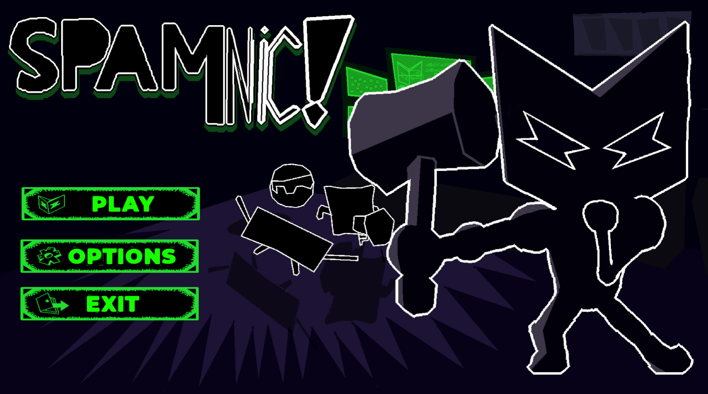

<h1 align="center" style="margin-bottom: 0;">
Nathan de Souza
</h1>

  

Olá, Meu nome é Nathan de Souza, tenho 19 anos e sou Desenvolvedor de jogos. Atuo como Game Designer, programador e Artista. Atualmente estou cursando jogos digitais pelo Senac. 

<h1 align="center" style="margin-bottom: 0;">
Conhecimentos

    

  
  
  

 

🕹️ Projetos em destaque
</h1>

- "[Spamnic](https://github.com/nathandesouza/Spamnic)" Um jogo de plataforma 3d de ação e aventura com o tema "Internet", feito com Unity, C#, Blender, Aseprite. 

  

